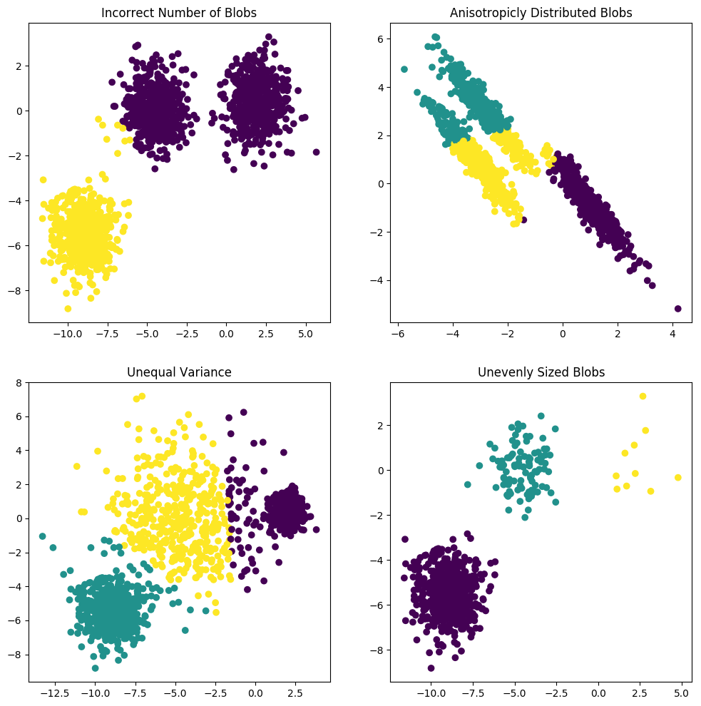

# Project - Blob Clustering

[Scikit-learn](http://scikit-learn.org/stable/) provides a built in `make_blobs` dataset. We'll use this dataset to explore the [K-Means Clustering](http://scikit-learn.org/stable/modules/generated/sklearn.cluster.KMeans.html) algorthim.

## Project Overview

[K-Means Clustering](http://scikit-learn.org/stable/modules/generated/sklearn.cluster.KMeans.html) aims to partition n observations into k clusters in which each observation belongs to the cluster with the nearest mean, serving as a prototype of the cluster. In this project we'll use [scikit-learn](http://scikit-learn.org/stable/) [K-Means](http://scikit-learn.org/stable/modules/generated/sklearn.cluster.KMeans.html) algorithm to cluster various blobs of data.

## Getting Started

### Prerequisites
You'll need to install:

* [Anaconda](https://www.continuum.io/downloads)
* [Python (Minimum 3)](https://www.continuum.io/blog/developer-blog/python-3-support-anaconda)
* [scikit-learn](https://anaconda.org/anaconda/scikit-learn)

### Data Files

* `make_blobs` - Provided by [scikit-learn](http://scikit-learn.org/stable/)

## Script

* `blob-cluster.py` - Main project script, creates scatterplots using the `make_blobs` data. Then uses [K-Means](http://scikit-learn.org/stable/modules/generated/sklearn.cluster.KMeans.html) to cluster the data. Outputs a png file of the blobs and their respective clusters.

### Output

## Authors

* **[Paul Foley](https://github.com/paulfoley)**
* [Udacity](https://www.udacity.com/)

## License

* <a rel="license" href="https://creativecommons.org/licenses/by-nc-nd/4.0/"> Creative Commons Attribution-NonCommercial-NoDerivatives 4.0 International License</a>

## Acknowledgments

* [scikit-learn](http://scikit-learn.org/stable/)
