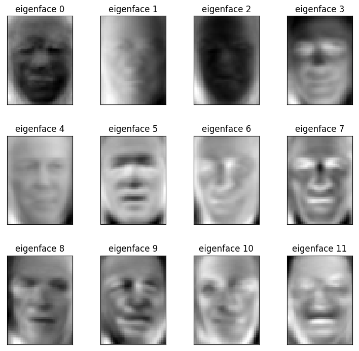

# Project - Eigenface Predictions

Facial recognition is one of the biggest use cases in machine learning! To experiment with facial recognition, the [University of Massachusetts](http://vis-www.cs.umass.edu/lfw/) has provided, a labeled face data set `fetch_lfw_people` that any machine learning enthusiast can play with.

## Project Overview

In this proejct we'll use the provided `fetch_lfw_people` data set, and use a [Support Vector Machine Classifier](http://scikit-learn.org/stable/modules/generated/sklearn.svm.SVC.html) to perform facial recognition. The goal of the project is to be able to predict the face of a picture the model has not yet seen. Also we will output a [Confusion Matrix](http://scikit-learn.org/stable/modules/generated/sklearn.metrics.confusion_matrix.html) as well as a [Classification Report](http://scikit-learn.org/stable/modules/generated/sklearn.metrics.classification_report.html) to see how our model performed.

## Getting Started

### Prerequisites
You'll need to install:

* [Anaconda](https://www.continuum.io/downloads)
* [Python (Minimum 3)](https://www.continuum.io/blog/developer-blog/python-3-support-anaconda)
* [scikit-learn](https://anaconda.org/anaconda/scikit-learn)

### Data Files

* `fetch_lfw_people` - Provided by the [University of Massachusetts](http://vis-www.cs.umass.edu/lfw/)

## Script

* `eigenfaces.py` - Main project script, creates a [Support Vector Machine Classifier](http://scikit-learn.org/stable/modules/generated/sklearn.svm.SVC.html) that will be used to recognize faces in the data set. The script outputs a png file of the eigenfaces as well as a [Confusion Matrix](http://scikit-learn.org/stable/modules/generated/sklearn.metrics.confusion_matrix.html) and a [Classification Report](http://scikit-learn.org/stable/modules/generated/sklearn.metrics.classification_report.html) to see how our model performed.

### Output

* `classification_report.csv` - A CSV file that shows the precision, recall, f1, and support score for each person in the data set.
* `confusion_matrix.csv` - A CSV file that shows how many of the faces were recognized correctly or incorrectly.

#### Eigenfaces

## Authors

* **[Paul Foley](https://github.com/paulfoley)**
* [Udacity](https://www.udacity.com/)

## License

* <a rel="license" href="https://creativecommons.org/licenses/by-nc-nd/4.0/"> Creative Commons Attribution-NonCommercial-NoDerivatives 4.0 International License</a>

## Acknowledgments

* The [University of Massachusetts](http://vis-www.cs.umass.edu/lfw/)
