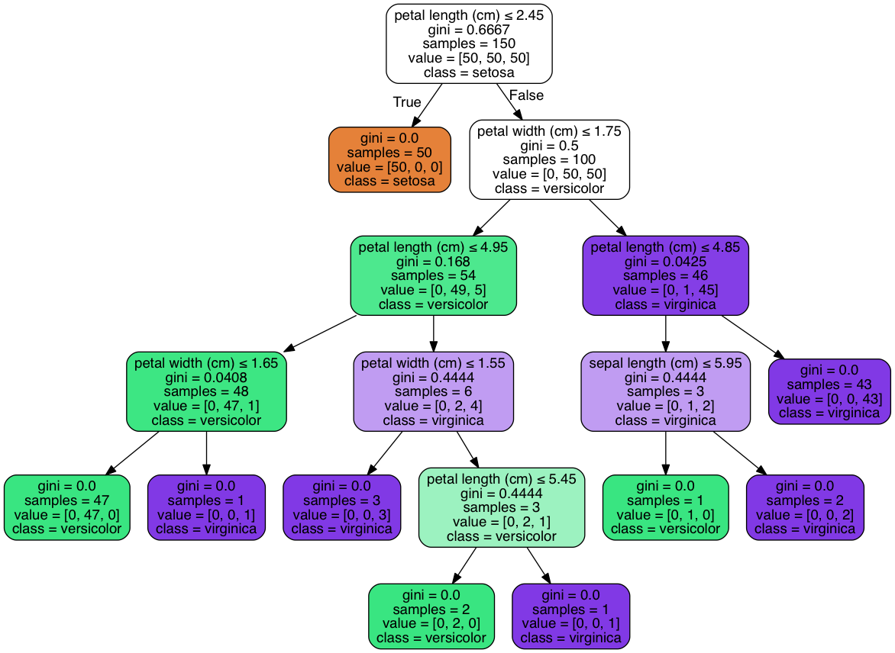

# Project - Iris Classification

Classification is one of the most used applications of machine learning! To experiment with classification, [scikit-learn](https://anaconda.org/anaconda/scikit-learn) has provided a classification dataset `load_iris`.

## Project Overview

In this proejct we'll use the provided `load_iris` dataset, to show how a [Decision Tree Classifier](http://scikit-learn.org/stable/modules/generated/sklearn.tree.DecisionTreeClassifier.html) works. The goal of the project is to be able to predict what class an iris belongs. After training our model, we will output a visual of the decision tree, showing how the model makes it classifying decisions.

## Getting Started

### Prerequisites
You'll need to install:

* [Anaconda](https://www.continuum.io/downloads)
* [Python (Minimum 3)](https://www.continuum.io/blog/developer-blog/python-3-support-anaconda)
* [scikit-learn](https://anaconda.org/anaconda/scikit-learn)

### Data Files

* `load_iris` - Provided by [scikit-learn](https://anaconda.org/anaconda/scikit-learn)

## Script

* `iris.py` - Main project script, creates a [Decision Tree Classifier](http://scikit-learn.org/stable/modules/generated/sklearn.tree.DecisionTreeClassifier.html) that will classify an iris based on its features. The script outputs a png file, showing visually the decision tree that the model will use to make its classification.

### Output

## Authors

* **[Paul Foley](https://github.com/paulfoley)**
* [Udacity](https://www.udacity.com/)

## License

* <a rel="license" href="https://creativecommons.org/licenses/by-nc-nd/4.0/"> Creative Commons Attribution-NonCommercial-NoDerivatives 4.0 International License</a>

## Acknowledgments

* [scikit-learn](https://anaconda.org/anaconda/scikit-learn)
