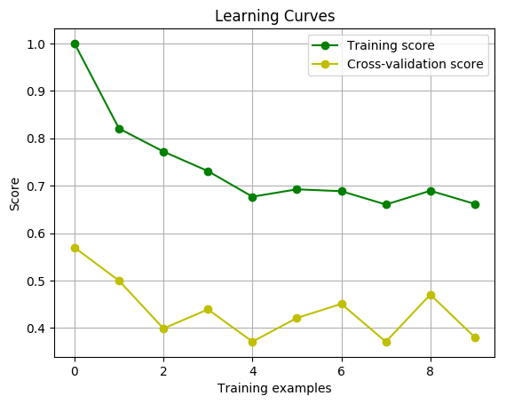
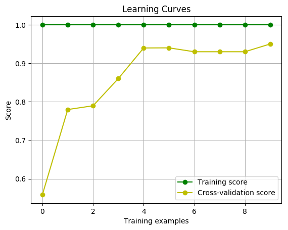
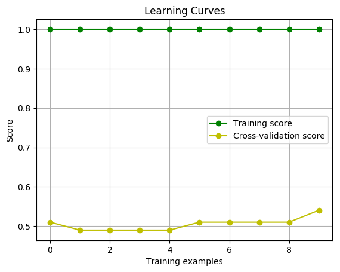

# Project - Learning Curves

Understaning [Learning Curves](http://scikit-learn.org/stable/auto_examples/model_selection/plot_learning_curve.html) is a critical skill of machine learning! To experiment with [Learning Curves](http://scikit-learn.org/stable/auto_examples/model_selection/plot_learning_curve.html), [Udacity](https://www.udacity.com/) has provided an example dataset `data.csv`.

## Project Overview

In this proejct we'll use the provided `data.csv` dataset to plot the [Learning Curves](http://scikit-learn.org/stable/auto_examples/model_selection/plot_learning_curve.html) of three different [scikit-learn](https://anaconda.org/anaconda/scikit-learn) estimators ([Logistic Regression](http://scikit-learn.org/stable/modules/generated/sklearn.linear_model.LogisticRegression.html), [Gradient Boosting Classifier](http://scikit-learn.org/stable/modules/generated/sklearn.ensemble.GradientBoostingClassifier.html), and [Support Vector Classifier](http://scikit-learn.org/stable/modules/svm.html)). 

The goal is to see which estimator best predicts the data not only for the training data, but also for the testing data.

### Project Steps

* Load the `data.csv` dataset provided by [Udacity](https://www.udacity.com/).
* Create the three different [scikit-learn](https://anaconda.org/anaconda/scikit-learn) estimators ([Logistic Regression](http://scikit-learn.org/stable/modules/generated/sklearn.linear_model.LogisticRegression.html), [Gradient Boosting Classifier](http://scikit-learn.org/stable/modules/generated/sklearn.ensemble.GradientBoostingClassifier.html), and [Support Vector Classifier](http://scikit-learn.org/stable/modules/svm.html)).
* Plot the [Learning Curves](http://scikit-learn.org/stable/auto_examples/model_selection/plot_learning_curve.html) for the three estimators.
* Determine which estimator is best.

## Getting Started

### Prerequisites
You'll need to install:

* [Anaconda](https://www.continuum.io/downloads)
* [Python (Minimum 3)](https://www.continuum.io/blog/developer-blog/python-3-support-anaconda)
* [scikit-learn](https://anaconda.org/anaconda/scikit-learn)
* [Pandas](https://anaconda.org/anaconda/pandas)
* [Numpy](https://anaconda.org/anaconda/numpy)
* [Matplotlib](https://anaconda.org/anaconda/matplotlib)

### Data Files

* `data.csv` - Provided by [Udacity](https://www.udacity.com/)

## Script

* `learning_curves.py` - Main project script, creates [Learning Curves](http://scikit-learn.org/stable/auto_examples/model_selection/plot_learning_curve.html) of the three different [scikit-learn](https://anaconda.org/anaconda/scikit-learn) estimators ([Logistic Regression](http://scikit-learn.org/stable/modules/generated/sklearn.linear_model.LogisticRegression.html), [Gradient Boosting Classifier](http://scikit-learn.org/stable/modules/generated/sklearn.ensemble.GradientBoostingClassifier.html), and [Support Vector Classifier](http://scikit-learn.org/stable/modules/svm.html))

### Output

#### Logistic Regression

##### Conclusion

The [Logistic Regression](http://scikit-learn.org/stable/modules/generated/sklearn.linear_model.LogisticRegression.html) model underfits the data! As neither the training score or the cross-validation score are close to 1.

#### Gradient Boosting Classifier

##### Conclusion

The [Gradient Boosting Classifier](http://scikit-learn.org/stable/modules/generated/sklearn.ensemble.GradientBoostingClassifier.html) model fits the data just right! The training score is 1 and the cross-validation score gets very close to 1.

#### Support Vector Classifier

##### Conclusion

The [Support Vector Classifier](http://scikit-learn.org/stable/modules/svm.html) model overfits the data! While the training score is 1, the cross-validation score is below .6. Which makes us think that this model just memorized the training data and doesn't generalize well to the population data.

## Authors

* **[Paul Foley](https://github.com/paulfoley)**
* [Udacity](https://www.udacity.com/)

## License

* <a rel="license" href="https://creativecommons.org/licenses/by-nc-nd/4.0/"> Creative Commons Attribution-NonCommercial-NoDerivatives 4.0 International License</a>

## Acknowledgments

* [scikit-learn](https://anaconda.org/anaconda/scikit-learn)
