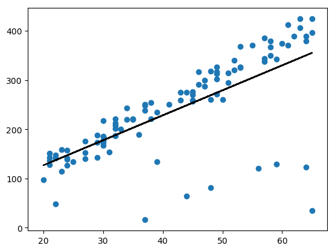
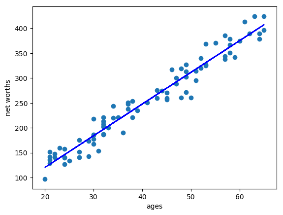

# Project - Learning Curves

Outlier Management is a critical skill in machine learning! To experiment with outliers, [Udacity](https://www.udacity.com/) has provided sample data, `practice_outliers_ages.pkl` and `practice_outliers_net_worths.pkl` to play with.

## Project Overview

In this proejct we'll use the provided `practice_outliers_ages.pkl` and `practice_outliers_net_worths.pkl` datasets to see how outliers effect a [scikit-learn](https://anaconda.org/anaconda/scikit-learn) [Linear Regression](http://scikit-learn.org/stable/modules/generated/sklearn.linear_model.LinearRegression.html) model.

The goal is to see how the [Linear Regression](http://scikit-learn.org/stable/modules/generated/sklearn.linear_model.LinearRegression.html) model better fits the data when the outliers are removed.

### Project Steps

* Load the `practice_outliers_ages.pkl` and `practice_outliers_net_worths.pkl` datasets provided by [Udacity](https://www.udacity.com/).
* Create and fit the [Linear Regression](http://scikit-learn.org/stable/modules/generated/sklearn.linear_model.LinearRegression.html) to the full dataset.
* Identify and remove outliers from the data.
* Re-fit the [Linear Regression](http://scikit-learn.org/stable/modules/generated/sklearn.linear_model.LinearRegression.html) to the new dataset.
* Plot the two [Linear Regression](http://scikit-learn.org/stable/modules/generated/sklearn.linear_model.LinearRegression.html) models, one for the full dataset and for the removed outler data set.
* Observe how the [Linear Regression](http://scikit-learn.org/stable/modules/generated/sklearn.linear_model.LinearRegression.html) model better fits the data.

## Getting Started

### Prerequisites
You'll need to install:

* [Anaconda](https://www.continuum.io/downloads)
* [Python (Minimum 3)](https://www.continuum.io/blog/developer-blog/python-3-support-anaconda)
* [scikit-learn](https://anaconda.org/anaconda/scikit-learn)
* [Numpy](https://anaconda.org/anaconda/numpy)
* [Matplotlib](https://anaconda.org/anaconda/matplotlib)

### Data Files

* `practice_outliers_ages.pkl`, `practice_outliers_net_worths.pkl` - Provided by [Udacity](https://www.udacity.com/)

## Script

* `outlier_removal.py` - Main project script, creates and fits a [Linear Regression](http://scikit-learn.org/stable/modules/generated/sklearn.linear_model.LinearRegression.html) model on the full dataset and then again on the dataset with the outliers removed. Outputs pngs of the regression model fitting the data.

### Output

#### Linear Regression on Full Dataset

#### Linear Regression with Outliers Removed

##### Conclusion

As we can see the [Linear Regression](http://scikit-learn.org/stable/modules/generated/sklearn.linear_model.LinearRegression.html) model fits the data better when the outliers have been removed.

## Authors

* **[Paul Foley](https://github.com/paulfoley)**
* [Udacity](https://www.udacity.com/)

## License

* <a rel="license" href="https://creativecommons.org/licenses/by-nc-nd/4.0/"> Creative Commons Attribution-NonCommercial-NoDerivatives 4.0 International License</a>

## Acknowledgments

* [scikit-learn](https://anaconda.org/anaconda/scikit-learn)
